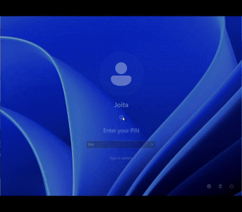

# Windows Password Recovery Provider

A custom Windows Credential Provider that enables password recovery directly from the Windows logon screen.

The provider supports:
- BitLocker Recovery Key–based password reset
- Windows Hello PIN–based password expiration

Both flows enforce password change at next login for improved security.

---

## Demo

### BitLocker Recovery Flow


### PIN Recovery Flow



---

## Features

- BitLocker recovery key validation
- Windows Hello PIN recovery flow
- Secure password reset using `NetUserSetInfo`
- Forced password change at next sign-in
- Dynamic Credential Provider UI
- Registry/debug logging support
- Installer-based deployment

---

## Requirements

- Windows 10/11
- Local administrator privileges
- BitLocker enabled (for BitLocker recovery flow)
- Local user account support only

---

## Installation

1. Run:

   ```bash
   windows-password-recovery.exe
   ```

2. Restart the machine after installation.

3. The Password Recovery tile should appear on the Windows login screen.

---

## Recovery Flows

### 🔹 BitLocker Recovery Flow

1. Select the Password Recovery tile
2. Enter the BitLocker recovery key
3. Password is reset to a temporary value
4. User is forced to change password at next login

### 🔹 PIN Recovery Flow

1. Select the PIN recovery option
2. Password expiration flag is set
3. User logs in using Windows Hello PIN
4. Windows prompts for a new password

> **Note:**  
> The BitLocker recovery flow performs a password reset and may invalidate existing app sessions or credentials tied to the previous password.  
> The PIN recovery flow is less disruptive and preserves the existing password until changed by the user.

---

## Security Notes

- No plaintext password storage
- Password reset requires recovery key validation or Windows Hello PIN access
- Temporary passwords are expired immediately
- Logging avoids storing sensitive information

---

## Limitations

- Supports local accounts only
- Domain and Azure AD accounts are not currently supported
